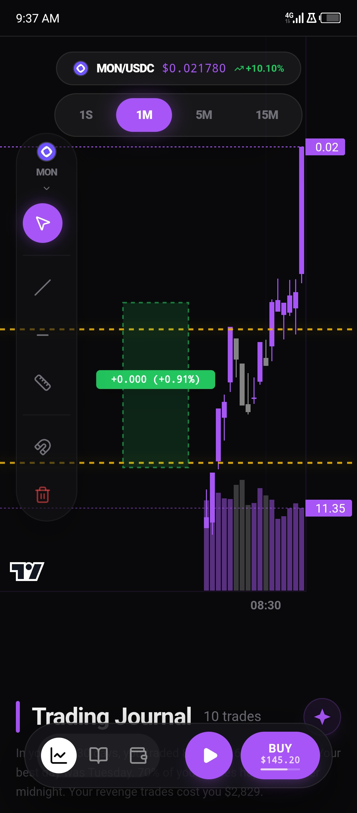
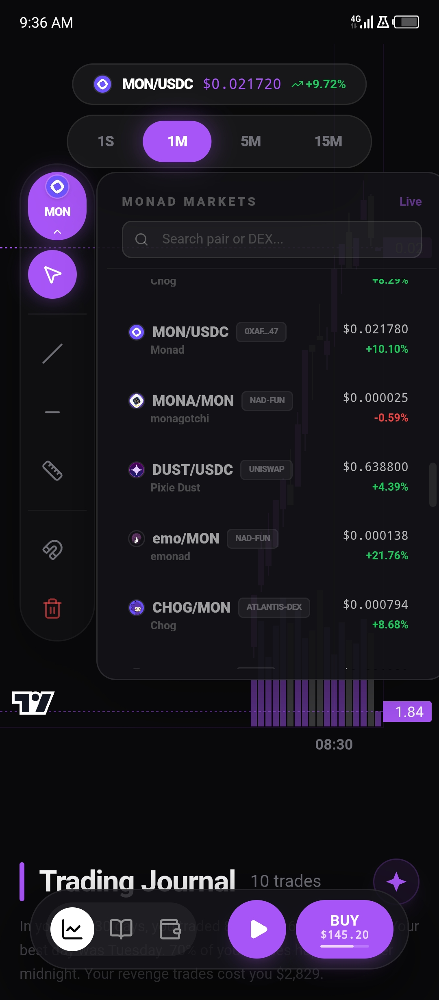
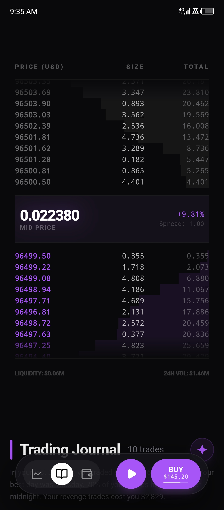

  

<h1 align="center">Dominus Quant (DQuant)</h1>

  Dominus Quant is a narrative-driven, AI-assisted crypto trading platform designed for real-time market insight and optional automated spot execution. Built as a personal project, it’s a proof-of-concept for **next-generation quant infrastructure**, combining behavioral analytics, distributed intelligence, and portfolio storytelling.

This project demonstrates what’s possible when **trading intelligence, narrative detection, and modular infrastructure** meet.

---

## Screenshots

  
  
  
  
  

---
# Dominus Quant

**AI-assisted, multi-user crypto trading platform for Monad testnet**

Dominus Quant is a production-oriented trading system designed to help real traders make better decisions through structured market intelligence, behavioral analytics, and optional automated execution.

It combines quant-style signal generation with a narrative layer that explains *why* decisions are made — not just what to trade.

---

## 🚀 Overview

Dominus Quant is built as a **non-custodial, multi-user trading platform** where:

* Users connect via embedded wallets powered by Privy
* Market data is streamed and analyzed in real time
* Trading signals are generated using structured agents
* Users can trade manually or enable automated execution
* Performance is tracked and visualized through analytics

This is not a UI demo — it is a **full-stack trading system prototype** designed for real backend integration and execution on Monad testnet.

---

## 🧠 Core Architecture

The system is built around a modular **agent pipeline**:

### 1. Market Agent

* Fetches live market data (price, liquidity, volume)
* Computes indicators (RSI, EMA, volatility)
* Produces a normalized market state

### 2. Sentiment Agent

* Interprets market conditions
* Classifies sentiment: bullish / bearish / neutral
* Outputs confidence + reasoning

### 3. Strategy Agent

* Combines market + sentiment signals
* Generates actionable decisions:

  * BUY / SELL / HOLD
  * Confidence score
  * Structured reasoning

### 4. Execution Layer

* Prepares transaction payloads for user wallets
* Supports:

  * Manual trading (user-confirmed)
  * Automated trading (strategy-driven)

---

## ⚙️ Features

### 📊 Market Intelligence

* Real-time price tracking
* Candle charts with multiple timeframes
* Order book visualization
* Token discovery via backend market service

### 💼 Wallet & Portfolio

* Non-custodial wallet via Privy
* EVM wallet address (auto-created)
* Balance tracking (ETH + tokens)
* Portfolio valuation and breakdown

### 🔁 Trading

* Manual trading with preview → confirm → execute flow
* Transaction preparation for wallet signing
* Trade history and lifecycle tracking

### ▶️ Auto Trading

* Strategy-driven execution engine
* Play / Pause control
* Periodic signal evaluation
* Per-user execution state

### 🧾 Trading Journal

* Structured trade history
* Performance tracking
* Session-based insights

### 📈 Analytics ("Wrap View")

* PnL tracking
* Win rate
* Volume and fees
* Drawdown and session performance

### 🧠 AI Insights

* Human-readable trade reasoning
* Generated from internal strategy logic
* No black-box outputs — fully explainable

---

## 🔐 Authentication & Wallets

Dominus Quant uses Privy for authentication and wallet management.

* Embedded wallet (EVM only)
* No private keys stored on backend
* Backend derives user identity from verified session
* All transactions are signed client-side

---

## 🌐 Network

* **Target Chain:** Monad Testnet
* **RPC:** https://testnet-rpc.monad.xyz
* Fully EVM-compatible

---

## 🏗️ Tech Stack

### Frontend

* Next.js (App Router)
* React + Zustand
* lightweight-charts
* framer-motion

### Backend

* Node.js (TypeScript)
* Express.js
* PostgreSQL
* Redis
* WebSockets
* Viem / Ethers.js

---

## 🔌 API Design

All backend endpoints follow a structured `/v1` contract:

### Markets

* `GET /v1/markets`
* `GET /v1/markets/:pairAddress/trades`
* `GET /v1/markets/:pairAddress/orderbook`

### Portfolio

* `GET /v1/portfolio`

### Trading

* `POST /v1/orders/preview`
* `POST /v1/orders`

### Strategy

* `GET /v1/strategies/:id/state`
* `PATCH /v1/strategies/:id/state`

### Insights

* `GET /v1/insights`

---

## ⚡ Real-Time System

WebSocket channels power live updates:

* `ticker` → price updates
* `orderbook` → depth updates
* `strategy_signals` → AI decisions
* `portfolio` → balance + PnL updates

---

## 🔄 User Flows

### Connect Wallet

1. User logs in via Privy
2. Embedded wallet is created (EVM)
3. Backend verifies session and maps user

### Trade (Manual)

1. Select token
2. Preview trade
3. Confirm and sign transaction
4. Track execution status

### Auto Trading

1. Enable strategy
2. Backend evaluates signals periodically
3. Signals emitted + optionally executed
4. Performance tracked automatically

---

## 📊 Design Philosophy

Dominus Quant is built around three principles:

### 1. Explainability over opacity

Every signal includes reasoning. No black-box trading.

### 2. Non-custodial by default

Users always control their funds.

### 3. System-first design

Clear separation between:

* data
* decision-making
* execution

---

## ⚠️ Current Status

* Frontend: complete and backend-ready
* Backend: in active development
* Data sources: transitioning from mock → live
* Trading: prepared for Monad testnet execution

---

## 🧪 Future Work

* Real DEX integration on Monad
* Advanced strategy configuration
* Backtesting engine
* Multi-agent strategy orchestration
* Risk management layer
* On-chain analytics integration

---

## 🧑‍💻 Author

Built as a high-performance portfolio project focused on:

* Quant systems
* Crypto infrastructure
* AI-assisted decision engines

---

## 📌 Final Note

Dominus Quant is not just a trading interface.

It is a **prototype for next-generation trading systems** where:

* machines assist,
* humans decide,
* and every action is explainable.

---

## ⭐ Project Activity

  
  
  
  

---

## Contributing

DQuant is modular quant infrastructure.  
Architecture discussions, signal experiments, and AI layer contributions are welcome.

Open an issue or submit a PR.

## License

MIT — open for experimentation and research.
